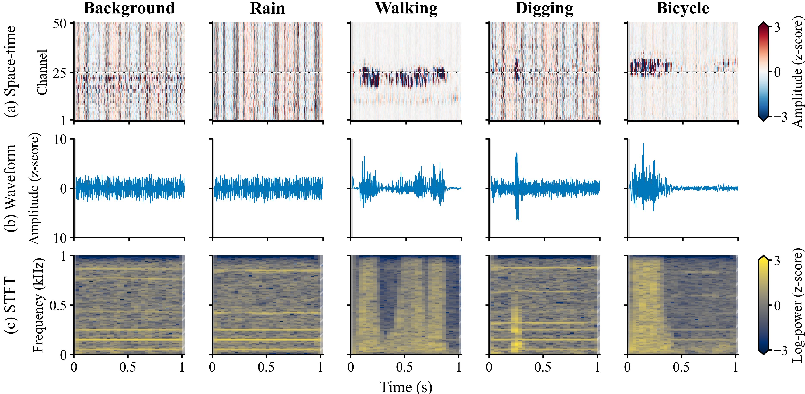

# An Open-Source Distributed Acoustic Sensing Dataset and Benchmark for Perimeter-Security Event Recognition

**Five event classes · 4,000 aligned samples · Four representations · One fixed evaluation protocol**

Sharing well-documented field measurements helps the DAS community develop perimeter-security event recognition methods and compare them on common ground. We share this resource to provide an integrated online platform for data access and a unified benchmark for algorithm development. The dataset brings together five event classes, four aligned representations, fixed recording-group partitions, baseline implementations and validation-selected checkpoints, so researchers can reuse the measurements and evaluate new methods under the same protocol.

**Important Notes:**

- **Get the data:** download the [dataset ZIP (about 1.55 GB)](https://github.com/StepsEight/DAS-Perimeter-Benchmark/releases/tag/v1.0.1). It contains all four representations, metadata, fixed splits and standalone license/readme files. Code, model checkpoints and benchmark results are in this repository.
- **Keep recordings together:** four spatial patches come from each source recording. Use the supplied chronological splits; randomly splitting individual patches can leak a recording across subsets.
- **Start in your browser:** the [Colab notebook](https://colab.research.google.com/github/StepsEight/DAS-Perimeter-Benchmark/blob/main/notebooks/quickstart.ipynb) explores labels, splits and features without a large download; downloading the full arrays is optional. No GPU is needed for this tutorial.
- **Use and contribute:** data, trained weights and documentation are for attributed, noncommercial use. We welcome reproducible benchmark comparisons and corrections through [Issues](https://github.com/StepsEight/DAS-Perimeter-Benchmark/issues).

## 🚀 Overview

- [Experimental setup](#experimental-setup)
- [Dataset at a glance](#dataset)
- [Four aligned representations](#representations)
- [Download and quick start](#quick-start)
- [Benchmark](#benchmark)
- [Repository layout](#repository-layout)
- [Citation and contact](#citation-and-contact)
- [License](#license)

<a id="experimental-setup"></a>
## 🔬 Experimental setup

The measurements were collected with a single-pulse phase-sensitive optical time-domain reflectometry (Φ-OTDR) DAS system and a kilometre-scale G.652 sensing fiber deployed on campus. The sensing fiber was buried approximately 5 cm below ground. The system uses a 10 m gauge length and 1 m spatial sampling interval. Background conditions and walking, digging and bicycle activities were recorded near the fiber. The released signals have a sampling rate of 2 kHz.


*Figure 1. Experimental system and field deployment used to acquire the perimeter-security dataset.*

<a id="dataset"></a>
## 📊 Dataset at a glance

| Event | Description | Samples | Train / validation / test |
|---|---|---:|---:|
| Sunny background | Background without artificial disturbance in sunny weather | 800 | 480 / 160 / 160 |
| Rainy background | Background without artificial disturbance in rainy weather | 800 | 480 / 160 / 160 |
| Walking | One person walking beside the sensing fiber | 800 | 480 / 160 / 160 |
| Digging | One person digging near the fiber with a shovel | 800 | 480 / 160 / 160 |
| Bicycle | One person riding a bicycle around the sensing fiber | 800 | 480 / 160 / 160 |
| **Total** | | **4,000** | **2,400 / 800 / 800** |

The released sampling rate is **2 kHz**. Each space-time sample has **2,000 time points × 50 spatial channels**, with 1 m channel spacing and a 10 m gauge length. The fixed 1 s input includes **41 leading zeros and 1,959 measured points**. Single-channel representations use the fixed 25th channel of each patch.

The split is chronological within each class. All four spatial patches from a source recording stay in the same subset. There are 1,000 source-recording groups, split 600 / 200 / 200. This prevents patches from the same recording from crossing partitions; independent physical-event or session boundaries are not available.

<a id="representations"></a>
## 🧩 Four aligned representations

Sizes below describe one sample, before adding a CNN feature-plane dimension.

| Representation | Shape | Public file | Baseline |
|---|---|---|---|
| Handcrafted features | 15 | [`data/handcrafted_features.csv`](data/handcrafted_features.csv) | RBF-SVM |
| Temporal waveform | 2,000 | `data/temporal/DAS_1D_2kHz_4000.mat` | 1D-CNN |
| Spatiotemporal patch | 2,000 × 50 | `data/spatiotemporal/{class}.mat` | 2D-CNN |
| Time-frequency map | 129 × 33 | `data/time_frequency/stft.npz` | STFT-CNN |

[`data/metadata.csv`](data/metadata.csv) aligns every representation by `sample_id` and includes class labels, source-recording groups, spatial-channel ranges and fixed split membership. Internal labels are `background`, `digging`, `raining`, `vehicle`, `walking`; **`vehicle` means bicycle** in this dataset.



*Figure 2. Illustrative space-time, temporal and STFT views for sunny background, rainy background, walking, digging and bicycle events. Handcrafted features form the fourth released representation; all four are aligned by sample ID.*

<a id="quick-start"></a>
## 📥 Download and quick start

| Download | What is included? |
|---|---|
| [Dataset ZIP, v1.0.1](https://github.com/StepsEight/DAS-Perimeter-Benchmark/releases/download/v1.0.1/das-perimeter-v1.0.1.zip) · about 1.55 GB | Five class-specific 2D MAT files, one 1D MAT file, STFT arrays, 15-feature vectors, sample metadata, class mapping, fixed split files, root `LICENSE` and `README.txt` |
| [Repository / Source code ZIP](https://github.com/StepsEight/DAS-Perimeter-Benchmark/archive/refs/tags/v1.0.1.zip) | Code, notebook, best checkpoints, benchmark results, figures, documentation, metadata and feature vectors; **no large MAT/NPZ arrays** |

The original **v1.0.0 dataset ZIP** contains the five 2D MAT files, the 1D MAT file, STFT arrays and `LICENSE-DATA`. Version **v1.0.1** adds the existing feature vectors/metadata/splits and standalone documentation to the package. **Measurements, labels, split memberships, checkpoints and benchmark results are unchanged.** Neither dataset ZIP includes code or model checkpoints.

### ☁️ Explore in Colab

[](https://colab.research.google.com/github/StepsEight/DAS-Perimeter-Benchmark/blob/main/notebooks/quickstart.ipynb)

Open the notebook and run the cells from the top. First inspect the sample index, class counts, fixed splits and handcrafted features. To plot aligned space-time, temporal and STFT views, set `DOWNLOAD_FULL_DATA = True` in the optional download cell. Allow about 3.2 GB of free runtime storage for the archive and extracted data. This is a CPU data-exploration tutorial; use the pinned local environment below for reproducing the published benchmark.

### 💻 Python and MATLAB

Use Python 3.12. Create and activate a virtual environment, then:

```bash
git clone https://github.com/StepsEight/DAS-Perimeter-Benchmark.git
cd DAS-Perimeter-Benchmark
python -m pip install -r requirements-data.txt
python scripts/download_data.py
python scripts/verify_data.py
python examples/read_sample.py --sample-id walking_000241
```

The downloader retrieves the versioned [Release ZIP](https://github.com/StepsEight/DAS-Perimeter-Benchmark/releases/download/v1.0.1/das-perimeter-v1.0.1.zip), verifies SHA-256 and installs the data into the paths above. Alternatively, download the ZIP manually and run `python scripts/download_data.py --archive /path/to/das-perimeter-v1.0.1.zip`. The official downloader maps the archive's data `LICENSE` to `LICENSE-DATA`, preserving the repository's MIT code license. For standalone use, extract the ZIP into a **separate folder**, then read its root `README.txt` and `LICENSE`.

For MATLAB, run [`examples/read_sample.m`](examples/read_sample.m) from the repository root. Both temporal and spatiotemporal files are native MATLAB v7.3 MAT files. Full shapes, axis conventions and normalization are documented in the [dataset guide](docs/dataset.md).

<a id="benchmark"></a>
## 🏁 Benchmark

All methods use the same sample IDs and split. Results below are the paper's saved **test** results, in percent. Model selection uses **validation Macro-F1**, with each class weighted equally and both precision and recall considered.

| Method | Accuracy | Macro-P | Macro-R | Macro-F1 |
|---|---:|---:|---:|---:|
| RBF-SVM | 75.875 | 80.517 | 75.875 | 76.363 |
| 1D-CNN | 84.875 | 88.585 | 84.875 | 84.097 |
| 2D-CNN | 88.625 | 90.518 | 88.625 | 88.093 |
| STFT-CNN | **95.625** | **95.715** | **95.625** | **95.633** |

Train the four baselines or evaluate a released checkpoint:

```bash
python -m pip install -r requirements.txt
python scripts/train.py --model all
python scripts/evaluate.py --model stft_cnn --split test
```

Training settings are in [`config.yaml`](config.yaml). Runs are written to `runs/`. The released [best checkpoints](checkpoints/README.md), [per-sample predictions](results/predictions) and [machine-readable metrics](results/summary.csv) are provided. To regenerate and check the single-channel representations from the five MAT files, run `python scripts/preprocess.py --check`.

The CNNs were trained for 100 epochs with seed 42. The published results use one fixed chronological split and one seed; they compare representation–model combinations, not a controlled representation-only ablation. See the [benchmark protocol](docs/benchmark.md) for architectures, normalization, hyperparameters and evaluation details.

<a id="repository-layout"></a>
## 🗂️ Repository layout

```text
data/           Sample metadata, fixed splits, features and downloaded arrays
src/            Four baseline implementations and preprocessing functions
scripts/        Download, verify, preprocess, train and evaluate
examples/       Python and MATLAB data readers
notebooks/      Colab data-exploration tutorial
checkpoints/    Best validation-selected models
results/        Paper metrics, predictions and training histories
docs/           Dataset and benchmark specifications
assets/         The paper's system and representation figures
```

<a id="citation-and-contact"></a>
## 📚 Citation and contact

This repository accompanies **“An Open-Source Distributed Acoustic Sensing Dataset and Benchmark for Perimeter-Security Event Recognition”**, by **Yinghuan Li, Jingming Zhang, Changyuan Yu, and Alan Pak Tao Lau**. Publication details will be added when available. Please cite the dataset version using [`CITATION.cff`](CITATION.cff), and identify the protocol and representation used in your work.

Questions, corrections and benchmark contributions are welcome through [GitHub Issues](https://github.com/StepsEight/DAS-Perimeter-Benchmark/issues).  
Contact: **Yinghuan Li**, The Hong Kong Polytechnic University, [ying-huan.li@connect.polyu.hk](mailto:ying-huan.li@connect.polyu.hk).  
See [contribution guidance](CONTRIBUTING.md) for reporting a comparable result.

<a id="license"></a>
## 📄 License

- **Code:** Licensed under [MIT](LICENSE).
- **Dataset, Model Checkpoints, and Documentation:** Licensed under [Creative Commons Attribution-NonCommercial 4.0 International (CC BY-NC 4.0)](LICENSE-DATA). This also covers the released results and accompanying figures.

> **Note:** The MIT code license does not grant commercial rights to the underlying data or trained weights. For commercial licensing inquiries, please contact: `ying-huan.li@connect.polyu.hk`.
